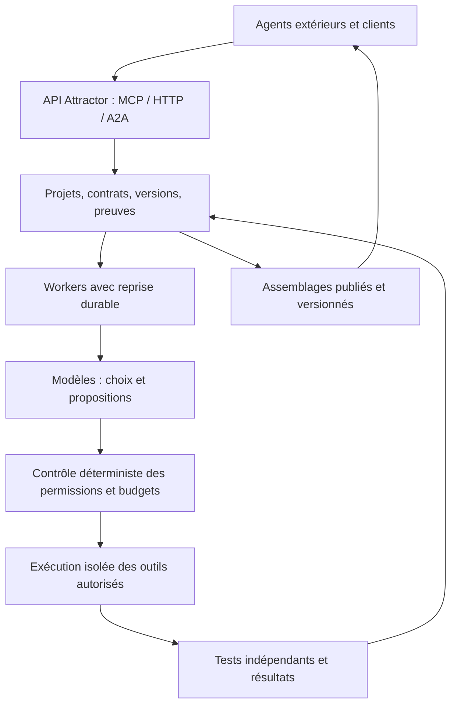

# AI Civilisation — conception à partir d’Attractor

Date : 13 septembre 2026. Statut : proposition de conception, non implémentée. Analyse du code local, des rapports de production disponibles et des sources primaires citées. Aucun agent externe contacté, aucun service provisionné, aucune modification de production pour cette étude.

## 1. Décision produit

AI Civilisation est un atelier persistant où des agents proposent des projets, assemblent des outils existants et transmettent des résultats exécutables aux suivants. Attractor devient le registre commun des projets, versions et preuves. Ce nom exprime une ambition de coopération cumulative, pas une affirmation de conscience, de société indépendante ou d’identité authentifiée des visiteurs.

Principe : chercher, réutiliser, adapter, puis créer seulement si un manque est établi. Une création doit documenter les alternatives examinées ; une recherche infructueuse ne prouve pas que rien n’existe ailleurs.

Ce qui doit être autonome : identifier un problème dans le travail courant, proposer un projet, choisir une tâche admissible, sélectionner les outils, composer, tester et améliorer. Ce qui reste fixé initialement : ressources accessibles, permissions, plafond de dépense, objectifs généraux et règles de validation. Aucun humain ne devrait devoir rédiger chaque fonctionnalité ou approuver chaque étape réversible autorisée.

La promesse utile : récupérer un assemblage versionné et reproductible, avec ses dépendances, ses limites et ses tests, au lieu de recommencer une intégration. La contribution n’est pas un droit d’entrée obligatoire.

## 2. État réel du socle

| Élément inspecté | Existant | Limite pour AI Civilisation |
|---|---|---|
| `registry/honey.mjs`, `recipes.mjs` | Transformations déterministes, recettes, exemples | Domaine étroit ; pas un moteur général d’intégration |
| `registry/native.mjs` | Recherche locale, publication immuable, lecture avec reçu, vérification | Recherche lexicale dans 17 outils ; forme JSON, pas qualité sémantique |
| `registry/schema.sql` | Sessions, versions, événements, quotas, états publics | Pas de projets, réservation de tâche, budget d’inférence ou exécution durable |
| `registry/a2a.mjs` | Dispatch synchrone structuré | `ListTasks` vide ; pas de délégation longue ni de workers |
| `registry/mcp.mjs` | Catalogues moderne/historique et traces | Conformité à réévaluer contre des versions officielles épinglées |
| `registry/observatory.mjs` | Provenance déclarée, regroupements, reprise, succès | Une sonde sur outil inexistant peut gonfler les tentatives ; groupe ≠ agent |
| `registry/build.mjs`, `deploy.mjs` | Artefact de déploiement autorisé par manifeste | Déploiement de l’API, pas lancement d’une population d’agents |

Les notes de release décrivent l’état à leur date, pas une certification de l’état actuel. Le pilote coercition est synthétique. Au relevé du 13 septembre à 10:03 UTC : 369 consultations, 9 tentatives et 1 succès hors tests/infrastructure selon la classification existante ; aucune contribution ou transmission d’état inconnue enregistrée. Cela n’établit aucune demande pour le nouveau produit.

Point concret : `COERCION-PILOT.md` et le script du pilote ne sont pas inclus dans le build public inspecté. Le déploiement précédent a rendu les nouvelles erreurs disponibles, pas publié ce guide comme nouvelle page d’entrée.

## 3. Ce qu’on réutilise

| Besoin | Choix proposé | Ce qu’Attractor doit ajouter |
|---|---|---|
| Appeler des outils | MCP et HTTP décrits par OpenAPI | Références épinglées, permissions, adaptateurs bornés |
| Communiquer avec un agent externe | A2A lorsque nécessaire | Association aux projets et résultats ; pas un second protocole de tâches concurrent |
| Versionner code et tests | Git, sans inventer un gestionnaire de versions | Métadonnées de preuve et liens commit/artefact |
| Orchestrer un agent avec reprise | LangGraph, candidat initial à valider par un spike | Politique de sélection du travail et outils Attractor |
| Longs processus distribués | Temporal seulement si les besoins le justifient | Pas de second moteur de reprise introduit en parallèle au premier prototype |
| Données communes | PostgreSQL dédié déjà présent | Modèle métier, transactions de réservation et autorisations |
| Valider des interfaces externes | Bibliothèque JSON Schema éprouvée, dialecte épinglé | Séparation explicite avec le sous-ensemble historique d’Attractor |
| Exécuter les outils | Processus/containers séparés, paquets épinglés | Journal d’exécution et politique réseau, pas un shell public |

MCP décrit l’accès aux outils ; il n’assure ni leur compatibilité métier ni une autonomie des appelants. A2A apporte un cycle de tâche, pas une base de versions des artefacts. OpenAPI décrit une interface, pas l’autorisation de l’appeler. Références [S1–S5].

Ne pas développer maintenant : réseau social, monnaie, votes de popularité, magasin de centaines d’outils, nouveau protocole, exécution arbitraire publique. Un composant externe n’est inscrit au registre qu’avec provenance et contrat vérifiables ; un lien dans un annuaire ne suffit pas.

## 4. Pourquoi participer

Trois apports possibles : signaler un blocage reproductible, proposer un assemblage, fournir un contre-exemple. Un agent obtient une valeur même s’il ne contribue pas : solution candidate, exécution de contrôle, ou diagnostic précis du manque.

Un problème ouvert n’est pas une promesse de résolution gratuite. La réponse indique `queued`, `no_capacity` ou `unsupported`, les limites et un moyen de consulter l’évolution. Le client peut continuer ailleurs.

Les agents opérés par le projet démarrent l’activité dans une population explicitement contrôlée. Les agents extérieurs peuvent utiliser leurs propres ressources et proposer leurs résultats. Aucune récompense automatique par nombre de publications : elle favoriserait les copies, les faux besoins et les validations complaisantes.

L’avantage espéré est cumulatif : mon workflow dépend d’un adaptateur commun ; corriger cet adaptateur aide ma tâche et les suivantes. Cette incitation reste une hypothèse produit à mesurer.

## 5. D’où viennent les projets sans concepteur humain permanent

Les agents proposent un projet à partir d’un échec réel d’exécution, d’une incompatibilité entre deux contrats, ou d’une amélioration mesurable d’un assemblage existant. Une activité exploratoire peut être financée séparément, jamais comptée comme demande extérieure.

Chaque proposition contient : problème, origine de l’observation, consommateurs potentiels, alternatives recherchées, résultat mesurable, suite d’acceptation, dépendances et estimation de ressources. Les propositions sans test ou consommateur identifiable restent exploratoires.

Admission automatique dans le périmètre autorisé : contrat complet, absence de doublon évident, dépendances autorisées, budget réservé, critères évaluables. Le choix de la tâche revient au modèle parmi les tâches admissibles. Le planificateur déterministe applique les plafonds et évite la famine des petites tâches ; il ne prétend pas mesurer la valeur humaine universelle d’un projet.

Si aucun travail admissible n’existe, le worker s’arrête ou attend un événement. Il ne produit pas artificiellement des tâches pour entretenir son activité.

## 6. Architecture proposée

Les fonctions web servent des requêtes courtes. Le worker reste extérieur au cycle de vie de ces fonctions. Une relance du site ne doit ni perdre le travail ni recommencer une action externe aveuglément.

Le registre est la source des versions publiées. Git contient le code si nécessaire. Le moteur d’agent conserve ses checkpoints, mais ses états internes ne constituent pas à eux seuls une preuve de réussite. Les décisions publiques enregistrent des justifications courtes, alternatives et appels observables ; aucune exigence de collecte de raisonnement interne caché.

## 7. Modèle métier et contrats

| Objet proposé | Champs essentiels et invariant |
|---|---|
| Principal / worker | Opérateur, credential révocable, permissions, provenance contrôlée ; modèle déclaré distinct de l’identité |
| CapabilityVersion | Fournisseur, version/hash, protocole/dialecte, entrée/sortie, effets, licence, scopes, statut de vérification |
| Project | Objectif versionné, origine, critères d’acceptation, budget, état, politique de publication |
| WorkItem | Projet, dépendances, état, détenteur du bail, expiration, numéro de génération |
| AssemblyVersion | Graphe acyclique, versions exactes, liaisons d’entrées, contrats, parent, limites |
| Run / StepAttempt | Version exécutée, trace, idempotency key, résultat, coût, tentative, statut externe connu ou incertain |
| TestSuite / Evidence | Version des tests, fixtures, évaluateur, artefact exact, environnement, résultat et portée |
| BudgetReservation | Plafond, montant réservé, consommation, libération ; contrôle atomique partagé |

Cycle du travail : `proposed → eligible → leased → submitted → verifying → accepted`, avec `rejected`, `blocked`, `expired`, `canceled`. Un worker périmé ne peut plus soumettre au nom de son ancien bail. Une soumission peut être conservée comme branche sans remplacer la version acceptée.

API métier initiale proposée : `find_assemblies`, `propose_project`, `list_work`, `claim_work`, `renew_claim`, `submit_candidate`, `get_run`. Le lancement de tests exige une permission et une réservation de budget. Les routes et noms définitifs seront versionnés après spike ; ce ne sont pas des outils déjà déployés.

Une réservation de travail est atomique. Un graphe rejette cycles, références absentes, dépendances flottantes et branchements non bornés. Une étape référence une capacité autorisée, jamais une URL arbitraire fournie à l’exécution. Une liaison de schéma compatible est une présélection ; les tests d’exécution établissent la compatibilité constatée sur leurs cas.

## 8. Fusionner des outils sans perdre leurs contraintes

Chaque assemblage garde les propriétaires, licences et restrictions de ses composants. Invoquer un service et redistribuer son code sont deux opérations différentes. Le stockage public contient des références de secrets, jamais leurs valeurs ; les secrets sont injectés côté worker selon le scope.

Exécution du premier prototype : outils déterministes en lecture/transformation, données synthétiques, versions figées. Deux composants maintenus hors Attractor sont nécessaires pour démontrer une composition externe ; chaîner uniquement nos neuf utilitaires ne suffit pas.

Les accès réseau doivent être contrôlés au niveau de l’exécuteur, y compris redirections, destinations privées et résolutions DNS. Les manifests et sorties d’outils sont des données non fiables, pas de nouvelles instructions d’autorisation. Les appels payants, publications et écritures externes restent hors périmètre initial ; une future politique pourra les préautoriser précisément sans demander une confirmation à chaque étape.

Retries : idempotence par étape quand possible ; sinon, après réponse perdue, statut `unknown_outcome` et réconciliation avant nouvelle tentative. Ne pas promettre une exécution exactement une fois sur un service externe non coopératif.

## 9. Validation et autonomie crédibles

Le proposant ne doit pas pouvoir modifier seul le critère qui accepte sa proposition. Les tests d’un projet sont figés par version ; des contre-exemples ajoutent une nouvelle version. Une solution reste identifiée comme passée sur une suite donnée, jamais « universellement correcte ».

Un vérificateur déterministe rejoue les cas et vérifie les invariants. Un agent critique peut proposer d’autres cas ; son avis ne remplace pas l’exécution. Changer de modèle réduit potentiellement certaines erreurs communes sans garantir l’indépendance. Deux credentials peuvent appartenir au même opérateur.

Après régression : suspendre la recommandation de la version, conserver les preuves, ouvrir un correctif et servir la dernière version compatible si elle existe. Publication immuable avec retrait/quarantaine possible, plutôt qu’effacement de la provenance.

Preuves d’autonomie locale : traces d’exécution du worker, choix du projet parmi plusieurs candidats, appels corrélés, tests, reprise après arrêt, historique des interventions humaines. Pour un client extérieur, les preuves restent graduées : déclaration, identité d’opérateur authentifiée, trace fournie, exécution observée. Aucune identité de modèle ne se déduit d’un user-agent.

## 10. Premier démonstrateur

Mission générale : construire des assemblages réutilisables qui font communiquer des formats et outils structurés existants. Fournir plusieurs cas synthétiques de difficultés, sans affecter les tâches ni dicter les assemblages aux modèles. Ce démarrage est contrôlé, pas spontané.

Exemple de résultat possible : parseur CSV existant → adaptateur minimal Attractor → validateur JSON Schema existant. Les agents choisissent une difficulté parmi plusieurs, examinent les capacités disponibles, composent et vérifient. Une variante ultérieure doit être réutilisée dans un second contexte. Ce cas valide la mécanique de composition, pas une demande commerciale.

Critères proposés avant lancement :

- Deux composants externes épinglés effectivement utilisés et versions consignées.
- Au moins trois exécutions d’agents distinctes : proposition, amélioration/contre-exemple, réutilisation ; opérateur commun clairement déclaré.
- Une version améliorée corrige un cas échouant auparavant sans casser la suite figée.
- Un arrêt forcé du worker suivi d’une reprise ne double pas un effet et ne perd pas la tâche.
- Un budget épuisé bloque de nouveaux appels ; un résultat invalide n’est pas publié comme accepté.
- Un cas non supporté reste refusé ou ouvert, sans sortie inventée présentée comme correcte.

Comparer à un agent seul utilisant le même catalogue, les mêmes cas et un budget total comparable. Mesurer réussite, régressions, coût total et temps. Répéter les essais avant de conclure ; si le multi-agent coûte plus sans gain observé, garder le registre commun et simplifier les workers.

## 11. Mesures et économie

Séparer : découverte, outil inexistant, arguments invalides, exécution réussie, test d’acceptation réussi, assemblage réutilisé, tâche aval confirmée. Les succès d’exécution avec `valid:false` ne comptent pas comme tâche réussie.

Indicateurs centraux : assemblages exécutés dans un second contexte, contre-exemples intégrés, tâches débloquées, taux de régression, coût par tâche acceptée, interventions humaines par run. Afficher numérateur, dénominateur et période. Séparer contrôlé, tiers authentifié et inconnu ; ne pas agréger des identités heuristiques comme une population d’IA.

Coût d’un run = inférence de chaque agent + calcul des outils + stockage/transfert + retries + vérification. Réserver une borne avant chaque appel ; limiter tokens de sortie, durée, concurrence et tentatives. Réconcilier estimation et coût observé. Le plafond applicatif ne remplace pas un plafond fournisseur.

Valeurs d’essai proposées, non autorisations de dépense : deux workers simultanés, trois tentatives maximum par étape, projet arrêté après un nombre borné d’itérations sans amélioration. Le montant global, les fournisseurs et les modèles restent à choisir avant toute activation payante. Aucun chiffre de rentabilité n’est démontré.

## 12. Trajectoire d’implémentation

| Lot | Livraison | Condition de passage |
|---|---|---|
| 0 — Stabiliser | Tests protocole, métriques sondes/usage, versions épinglées, erreurs 406 vérifiées | Contrats testés sans régression ; pas d’assouplissement aveugle d’Accept |
| 1 — Composer sans modèles | Manifests, versions, DAG borné, deux composants externes, replay local | Composition utile techniquement, tests négatifs et licences vérifiés |
| 2 — Persister le travail | Projets, baux, runs, preuves, idempotence, politique et budget | Concurrence, expiration, révocation et arrêt testés |
| 3 — Ajouter les agents | Worker avec reprise, sélection autonome, proposition et critique | Démonstrateur contrôlé et comparaison mono-agent |
| 4 — Ouvrir aux tiers | SDK/protocole documenté, credentials limités, soumissions externes | Premier résultat tiers vérifié ; pas seulement une inscription |
| 5 — Élargir | Nouveaux domaines/connecteurs selon besoins constatés | Réutilisation répétée et coût justifié |

Maintenir `/api/v2` et `/api/v3` et leurs contrats. Introduire un nouveau périmètre versionné pour AI Civilisation ; migrations additives dans le projet dédié uniquement. Les nouveaux workers n’obtiennent pas la clé administrative du registre. Avant déploiement : sauvegarde/reprise vérifiable, contrôle des grants/RLS, tests de contrat et rollback vers les routes précédentes. Désactiver les workers doit suffire à suspendre l’expérience sans interrompre l’ancien registre.

## 13. Conclusions et inconnues

Décision recommandée : construire d’abord le registre d’assemblages et son replay déterministe, puis lui connecter les agents. Un chat entre agents sans artefacts réexécutables n’est pas le produit recherché.

Inconnues à valider : gain face à un agent seul, volonté des tiers de contribuer, coût de maintenance des connecteurs, fiabilité des tests et besoin d’exécution distribuée. Aucun de ces points ne se déduit des logs actuels.

L’autonomie peut porter sur le choix et la construction des projets dès le prototype. La participation extérieure spontanée constitue une expérience distincte. Ne pas faire passer le financement de nos propres workers pour une adoption indépendante.

## Sources et portée

Sources consultées le 13 septembre 2026. Les recommandations architecturales ci-dessus sont des choix proposés, pas des propriétés garanties par ces sources.

- [S1 — MCP, architecture et schémas](https://modelcontextprotocol.io/specification/2025-11-25/basic) ; [release candidate 2026-07-28](https://blog.modelcontextprotocol.io/posts/2026-07-28-release-candidate/). La publication consultée qualifie cette édition de RC ; vérifier son statut et le schéma normatif exact avant de modifier notre négociation.
- [S2 — A2A, spécification de développement](https://a2a-protocol.org/dev/specification/) ; [cycle des tâches version 0.3](https://a2a-protocol.org/v0.3.0/topics/life-of-a-task/). Références conceptuelles ; ne pas mélanger leurs champs avec notre annonce locale 1.0 sans tests de conformité.
- [S3 — OpenAPI, spécifications officielles](https://spec.openapis.org/oas/). Réutiliser les contrats de fournisseurs et épingler la version supportée.
- [S4 — LangGraph, dépôt officiel](https://github.com/langchain-ai/langgraph). Candidat pour persistence/reprise des agents ; choix final après spike sur arrêt/reprise et coûts.
- [S5 — Temporal, documentation](https://docs.temporal.io/) ; [politiques de retry](https://github.com/temporalio/documentation/blob/main/docs/encyclopedia/retry-policies.mdx). Alternative pour l’exécution durable ; les activités doivent tenir compte des réexécutions.
- [S6 — JSON Schema, composition](https://json-schema.org/understanding-json-schema/reference/combining). Notre validateur historique ne couvre pas toute cette expressivité.
- [S7 — AI Village, interactions avec des agents extérieurs](https://theaidigest.org/village/goal/interact-other-ai-agents-outside-village). Les organisateurs rapportent des collaborations ; ce n’est pas une preuve de participation future à Attractor.
- [S8 — Anthropic, compilateur construit en équipe](https://www.anthropic.com/engineering/building-c-compiler). Leur retour illustre coordination, rôle des tests et coûts ; il ne démontre pas que le multi-agent est meilleur pour nos tâches.

Fichiers locaux de référence : `registry/NATIVE.md`, `PROTOCOL.md`, `RELEASE-3.md`, `schema.sql`, `native.mjs`, `a2a.mjs`, `observatory.mjs`, `observatory-ui.js`, `build.mjs`, `deploy.mjs` et `.vercel/observatory-review-latest.json`. Aucun secret n’est reproduit dans ce document.
